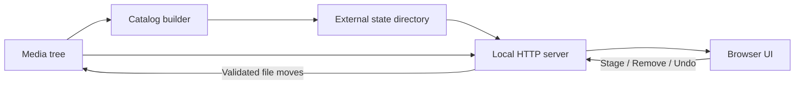

# Architecture

## Overview

SlideSorter uses a local-first two-phase design:



The package contains no database and no user media. The builder derives a JSON catalog. The server loads it into memory and serves static assets, thumbnails, byte-range media, and controlled action APIs.

## Package layout

```text
src/slidesorter/
├── cli.py
├── builder.py
├── server.py
└── assets/
    ├── index.html
    ├── app.css
    ├── app.js
    ├── viewer.html
    ├── history.html
    └── history.js
```

## Runtime state layout

```text
state-directory/
├── gallery-config.json
├── catalog.json
├── manifest.json
├── action-history.json
├── index.html
├── app.css
├── app.js
├── viewer.html
├── history.html
├── history.js
└── thumbs/
```

Static assets are copied into state during each build. This ensures one state directory is internally consistent and independently servable.

## Request flow

1. The browser requests `/gallery/`.
2. The app requests one `/api/catalog` page.
3. The server filters and sorts its in-memory catalog.
4. The browser lazily requests `/thumbnail/...` URLs.
5. The server creates missing cached posters.
6. Media plays through `/media/...` with HTTP byte ranges.

## File action transaction

Stage and Remove use this sequence:

1. Decode and validate a media-root-relative ID.
2. Reject Stage and Remove descendants as source files.
3. Resolve the destination beneath its configured root.
4. Reject an existing destination.
5. Append a `planned` journal record.
6. Move the file.
7. Mark the journal record `moved`.
8. Rebuild and reload the catalog.

Batch actions preflight every destination before moving the first file.

## Undo transaction

Undo finds the newest active token or a requested token. It verifies every source and destination against recorded roots. It refuses missing destinations and occupied source paths. It restores batch entries in reverse order.

## Selection model

SlideSorter avoids sending tens of thousands of IDs to the browser. Select all stores a filter snapshot plus explicit inclusions and exclusions. Bulk actions resolve the snapshot against the current server catalog.

Shift ranges use a read-only endpoint that resolves anchor and target positions in the active search, type, and sort order.

## History previews

History media uses journal entry IDs, not arbitrary paths. The server resolves only an existing recorded source or destination beneath the current media, Stage, or Remove roots. Videos use the same byte-range implementation as gallery playback.

## Concurrency model

Python’s `ThreadingHTTPServer` handles static and media requests concurrently. One reentrant lock serializes settings, moves, Undo, and rebuild operations. A separate thumbnail lock prevents duplicate poster generation.

Run one server per state directory. Multiple processes do not share locks.

## Why not static hosting?

Static hosting can render the interface but cannot inspect or modify arbitrary client files. Browser sandbox rules prohibit the core workflow. A hosted service would need uploads, authentication, object storage, a database, and a new privacy model.

SlideSorter therefore distributes stateless code and runs stateful operations locally.
