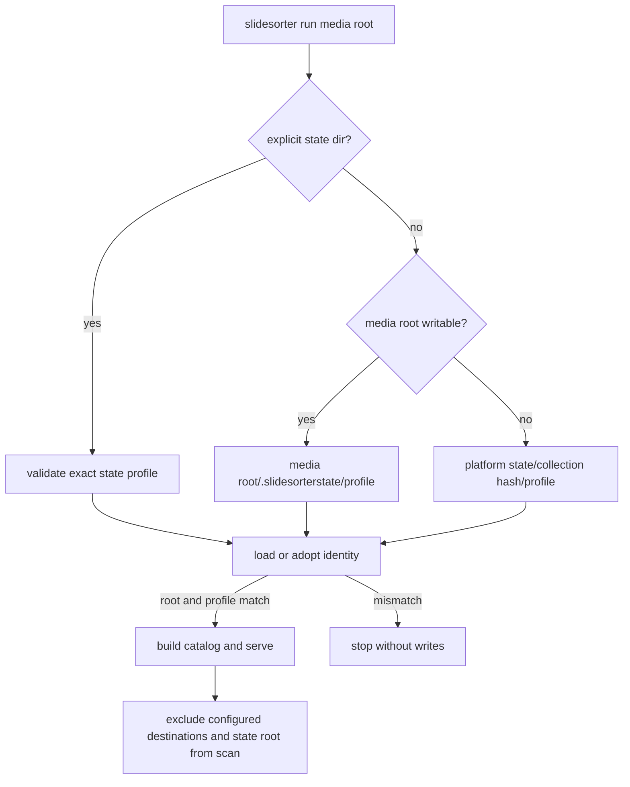

# feat: Isolate collection state profiles

## Overview

Make SlideSorter's durable state collection-scoped by default, while allowing
separate named workflows for the same media tree. A default `slidesorter run
MEDIA_ROOT` should create state at `MEDIA_ROOT/.slidesorterstate/default` when
that location is writable and should never catalogue it. If that cannot be
created, the application should use a stable, collection-specific fallback
under the platform state root.

The work also prevents a state directory, especially an explicitly supplied
one, from being silently reused for a different collection. Each state profile
will record its canonical collection identity and profile name; a mismatch must
abort before assets, catalog, configuration, or history are changed.

## Problem Frame

The current default is one global `default` state directory. Starting
SlideSorter for a second root overwrites the catalog and configuration while
leaving `action-history.json` behind. That makes independent workflows hard to
run and can mix recovery history across collections. The user needs several
safe concurrent instances, state located with the collection where practical,
and an explicit compatibility boundary for all state locations.

## Requirements Trace

- R1. Default state is per collection and colocated under the media root when
  writable.
- R2. Default state is never discovered or exposed as source media.
- R3. A named profile provides independent catalog, settings, thumbnails, and
  action history for the same collection.
- R4. State associated with a different canonical media root is rejected before
  any mutation; existing compatible state is adopted without losing history.
- R5. A non-writable collection still receives a stable, unique platform-state
  fallback rather than a shared `default` directory.
- R6. CLI and documentation make the state, profile, fallback, and one-server
  constraints understandable and preserve explicit `--state-dir` workflows.
- R7. The currently active Kepler collection state is moved into its new default
  profile without discarding its catalog, settings, thumbnails, or Undo journal.

## Scope Boundaries

- Do not migrate, merge, or delete old state automatically.
- The one requested live Kepler migration is a separately verified operational
  action, not general automatic migration behavior.
- Do not add cross-process locking; one server remains the owner of one state
  profile.
- Do not identify physical hardware volumes in this release; canonical media
  root identity is the compatibility boundary.
- Do not change destination move or Undo semantics beyond preserving their
  isolation in the correct profile.

## Context & Research

### Relevant Code and Patterns

- `src/slidesorter/cli.py` translates `run` arguments into a builder invocation
  followed by a server invocation; it is the appropriate point to resolve an
  automatic profile state path.
- `src/slidesorter/builder.py` owns `gallery-config.json`, remembers settings
  only for a matching root, and prunes action destinations in `discover_media`.
  Its state directory is the right place to persist the compatibility metadata
  and to exclude colocated state.
- `src/slidesorter/server.py` rebuilds by passing the persisted media and
  gallery roots back to the builder, so a compatible configuration must remain
  self-contained.
- `tests/test_builder.py` establishes disposable media/state fixtures; new
  coverage belongs alongside it and in a focused CLI test module.
- `docs/ARCHITECTURE.md`, `docs/CONFIGURATION.md`, and
  `docs/STATE_AND_PRIVACY.md` already describe external state, its data, and
  concurrency constraints.

### Institutional Learnings

- The existing local-gallery investigation records that recovery actions depend
  on validated media-relative paths and a durable manifest/journal. State
  isolation must preserve those recovery artifacts rather than clearing or
  relocating them implicitly.

### External References

- No external research is needed: this is a local Python path-and-state design,
  and the repository already has direct builder/configuration patterns.

## Key Technical Decisions

- **State layout:** use `MEDIA_ROOT/.slidesorterstate/<profile>` for automatic
  state. This keeps review metadata beside the collection without inserting it
  in the source tree's visible media catalog.
- **Profiles:** add `--profile NAME`, defaulting to `default`. Profiles use a
  validated simple name and are child directories only; no path separators or
  traversal are accepted. This makes parallel, intentional workflows explicit.
- **Fallback:** when creating the colocated state root fails, derive a stable
  fallback directory from the resolved media-root path under the existing
  platform state root. The root identifier prevents the current shared-default
  collision while remaining deterministic across invocations.
- **Identity record:** persist a schema/versioned identity containing canonical
  media-root path and profile in `gallery-config.json`. A pre-existing config
  with a different root or profile raises a clear compatibility error before a
  build writes any files. Legacy compatible config is adopted by adding the
  record on its next successful build.
- **Explicit state directories:** `--state-dir` remains an exact state-profile
  directory for scripting and temporary sessions. `--profile` is rejected when
  combined with an explicit state dir so its meaning cannot be ambiguous.
- **Environment override:** retain `SLIDESORTER_STATE_DIR` as the parent for
  automatic fallback paths, not as a shared state directory. This preserves its
  role as a location choice while fixing collection collisions.

## Open Questions

### Resolved During Planning

- **Should collection identity include a physical disk UUID?** No for this
  release. Canonical root equality catches the destructive state-sharing case
  without platform-specific device lookup or making remount behavior fragile.
- **Should automatic state be a sibling of the root?** No. The requested hidden
  directory is inside the collection, and an explicit exclusion protects scans.
- **Should a profile reuse a state path silently when another root is selected?**
  No. The process must stop and direct the user to select a different profile or
  state directory.

### Deferred to Implementation

- Exact fallback directory spelling and hashing helper names; they should be
  deterministic, path-safe, and documented once the existing parser and tests
  establish the cleanest insertion point.
- Whether to report the selected state path only in CLI startup text or also in
  the browser Settings payload; the implementation should select the smallest
  surface that makes active profile visibility clear.

## High-Level Technical Design

> *This illustrates the intended approach and is directional guidance for
> review, not implementation specification. The implementing agent should
> treat it as context, not code to reproduce.*

## Implementation Units

- [x] **Unit 1: Add collection state resolution and identity validation**

**Goal:** Centralize profile-name validation, automatic colocated/fallback state
resolution, and no-write compatibility checks.

**Requirements:** R1, R3, R4, R5.

**Dependencies:** None.

**Files:**
- Create: `src/slidesorter/state.py`
- Modify: `src/slidesorter/builder.py`
- Test: `tests/test_state.py`
- Test: `tests/test_builder.py`

**Approach:** Introduce a small state-domain module that resolves paths before
the builder creates directories, uses the existing platform state-root policy
for fallback, and reads only existing configuration for compatibility. Persist
the resolved identity in the build configuration and support adopting older
matching configs that lack identity metadata.

**Patterns to follow:** `builder.default_state_root`,
`builder.remembered_config`, and `GalleryConfig.load`'s explicit path
validation.

**Test scenarios:**
- Happy path: a writable media root resolves the default profile beneath its
  hidden `.slidesorterstate` directory.
- Happy path: two profile names for one root resolve to independent paths.
- Edge case: profile names with separators, traversal, or an empty value are
  rejected.
- Error path: a pre-existing config for another canonical root rejects before
  catalog/config/history writes occur.
- Integration: a legacy config with the same root is adopted and receives an
  identity without replacing its action history.
- Integration: simulated colocated-directory creation failure selects a stable
  hashed platform-state fallback for the same root and a different fallback for
  a different root.

**Verification:** State choice is deterministic, profiles are isolated, and a
mismatched state directory cannot be mutated.

- [x] **Unit 2: Wire profiles through the CLI and rebuild lifecycle**

**Goal:** Make `run` choose the new automatic state path, maintain exact
explicit `--state-dir` behavior, and ensure rebuilds remain on the same state
profile.

**Requirements:** R1, R3, R4, R6.

**Dependencies:** Unit 1.

**Files:**
- Modify: `src/slidesorter/cli.py`
- Modify: `src/slidesorter/builder.py`
- Modify: `src/slidesorter/server.py`
- Test: `tests/test_cli.py`
- Test: `tests/test_server.py`

**Approach:** Change parser defaults so `run` can distinguish omitted state
from an explicit state directory. Add `--profile` only to automatic `run`
resolution. Have the builder and server preserve/read the identity data during
initial build, settings writes, and server-triggered rebuilds. Keep direct
`build --gallery-root` and `serve --config` usable, but apply the same
compatibility check when their state already has an identity.

**Patterns to follow:** `cli.run` forwarding, `GalleryConfig.rebuild_command`,
and `GalleryConfig.load` compatibility handling.

**Test scenarios:**
- Happy path: `run root` forwards a hidden, default-profile state path.
- Happy path: `run root --profile triage` forwards a separate profile state
  path.
- Error path: `--state-dir` with `--profile` is rejected rather than silently
  interpreting one inside the other.
- Integration: a server-triggered rebuild keeps its original state directory
  and identity.
- Integration: direct build against state assigned to another root fails before
  copying assets or overwriting config.

**Verification:** Every command path either operates on one verified profile or
exits with an actionable compatibility message.

- [x] **Unit 3: Exclude generated colocated state from all catalog and media routes**

**Goal:** Keep thumbnail cache and generated files invisible when state is
inside the scanned collection.

**Requirements:** R2.

**Dependencies:** Unit 1.

**Files:**
- Modify: `src/slidesorter/builder.py`
- Modify: `src/slidesorter/server.py`
- Test: `tests/test_builder.py`
- Test: `tests/test_server.py`

**Approach:** Extend the builder's existing exclusion list with a state root
when it descends from the media root. Apply the same exclusion at server media
and thumbnail resolution so manually requested paths below state cannot be
served. Do not weaken the current destination-root validation.

**Patterns to follow:** `discover_media` directory pruning and the action-root
checks in `GalleryHandler.path_for` / source validation.

**Test scenarios:**
- Happy path: a default colocated state build catalogs media adjacent to state
  but no cached thumbnail or generated asset.
- Edge case: a state directory nested several levels beneath the root is
  excluded recursively.
- Error path: a media or thumbnail request addressed into a colocated state
  directory is refused.
- Integration: configured Stage/Remove exclusion and state exclusion both hold
  in the same scan.

**Verification:** Catalogs and source-serving APIs contain only real media,
not runtime artifacts.

- [x] **Unit 4: Update CLI and lifecycle documentation**

**Goal:** Make durable state ownership, profiles, fallback behavior, migration,
and concurrent-instance constraints clear to users and contributors.

**Requirements:** R6.

**Dependencies:** Units 1–3.

**Files:**
- Modify: `README.md`
- Modify: `docs/ARCHITECTURE.md`
- Modify: `docs/CONFIGURATION.md`
- Modify: `docs/STATE_AND_PRIVACY.md`
- Modify: `docs/FAQ.md`
- Modify: `docs/DEVELOPMENT.md`
- Modify: `CHANGELOG.md`

**Approach:** Replace shared-default examples with the profile-aware default,
document when to use explicit temporary state, explain the safe mismatch error
and legacy adoption path, and retain the one-server-per-state-profile rule.

**Patterns to follow:** current configuration tables, state-data inventory, and
the architecture concurrency section.

**Test scenarios:**
- Test expectation: none — documentation change; the CLI help and automated
  tests from Units 1–3 are the behavioral verification.

**Verification:** A user can start two collections, or two profiles of one
collection, without guessing where state or history will live.

- [x] **Unit 5: Migrate the current Kepler gallery state**

**Goal:** Move the active Kepler gallery state into the new default profile so
the user can continue the existing workflow with its settings and History.

**Requirements:** R7.

**Dependencies:** Units 1–3.

**Files:**
- Runtime state only: current Kepler gallery state and its new collection state
  profile.

**Approach:** Stop the local server cleanly, inventory the existing state and
its journal before changing it, confirm that the intended default destination
is absent or empty, then perform one same-volume rename where possible. When
the active report state and Kepler profile are on different volumes, copy into
a destination staging directory, compare the configuration and journal
checksums/counts, promote it only after verification, and retain the source
until the new profile has started successfully. Start the new profile through
the updated CLI and verify that the pre-move journal and settings are present
before reporting completion. If the destination or source is unavailable, do
not overwrite it; preserve the source and report the exact blocker.

**Patterns to follow:** The documented state inventory in
`docs/STATE_AND_PRIVACY.md` and the existing config/journal data model.

**Test scenarios:**
- Integration: pre- and post-move inventory shows the same action-history
  checksum and the new profile config resolves to the Kepler media root.
- Error path: a non-empty destination or unavailable source stops the migration
  without overwriting either location.

**Verification:** The local gallery starts from the new default state path with
the prior catalog, destinations, and recoverable History intact.

## System-Wide Impact

- **Interaction graph:** CLI resolves state; builder validates/records it;
  server reloads it; UI settings and History continue to use the profile's
  existing config and journal.
- **Error propagation:** state mismatch is a clear CLI/build failure before
  `mkdir`, asset copy, catalog write, or journal mutation.
- **State lifecycle risks:** colocated state must be pruned from walks and must
  retain journal files through compatible legacy adoption.
- **API surface parity:** `run`, direct `build`, and server rebuild must have
  the same root/state compatibility rule.
- **Integration coverage:** tests must cover path resolution, legacy adoption,
  builder output, and server rebuild behavior as a chain.
- **Unchanged invariants:** destination actions remain validated and recoverable;
  `--state-dir` remains an exact directory; no action moves are performed while
  resolving or validating state.

## Risks & Dependencies

| Risk | Mitigation |
|---|---|
| Existing users rely on the global default path | Leave explicit paths fully supported; document old-state adoption and do not delete or migrate it automatically. |
| State directory itself gets indexed or served as media | Add builder pruning and matching server-side denial coverage. |
| A mismatch check happens after generated files are copied | Resolve/read identity before directory creation or any build write, with a test that preserves sentinels. |
| Two servers act on one profile | Keep and clarify the existing one-server rule; profiles allow isolation but do not add interprocess locks. |
| Read-only media roots cannot host state | Fall back deterministically to platform state, scoped by collection hash and profile. |
| Kepler state migration crosses volumes | Copy to a staging sibling, compare critical state before promotion, start the new profile, and only then remove the old source if it was a successful move. |

## Documentation / Operational Notes

- This is a minor feature release because it changes the default runtime-state
  location and adds a CLI flag.
- Existing state remains usable by passing its path explicitly; compatible
  legacy state gains identity metadata during a normal rebuild.
- Back up `action-history.json` with its collection while Undo remains useful.

## Sources & References

- Related code: `src/slidesorter/cli.py`, `src/slidesorter/builder.py`, and
  `src/slidesorter/server.py`
- Related documentation: `docs/ARCHITECTURE.md`, `docs/CONFIGURATION.md`, and
  `docs/STATE_AND_PRIVACY.md`
- Related local learning: the local Kepler gallery recovery architecture,
  documented in the workspace memory registry.
